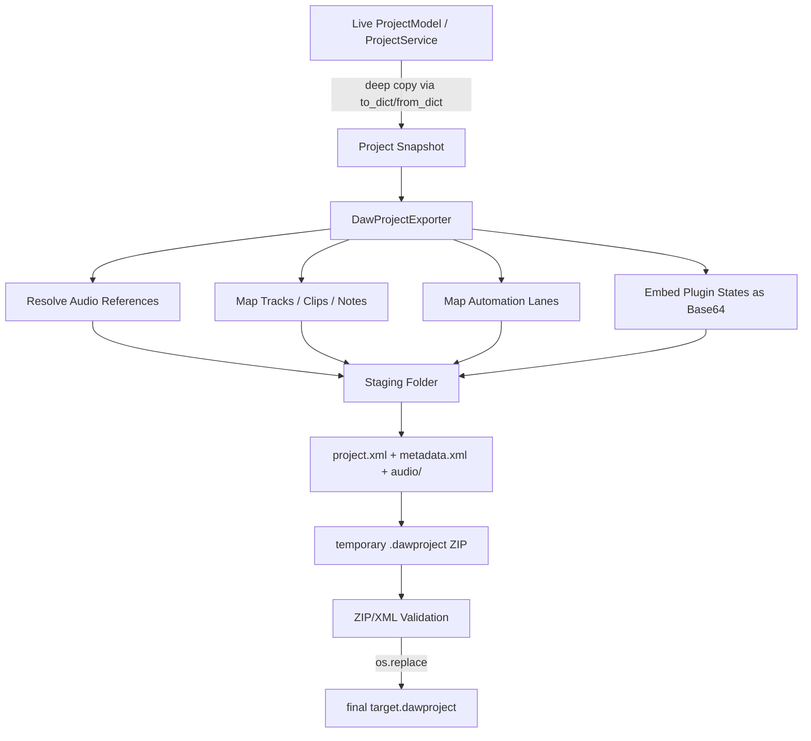
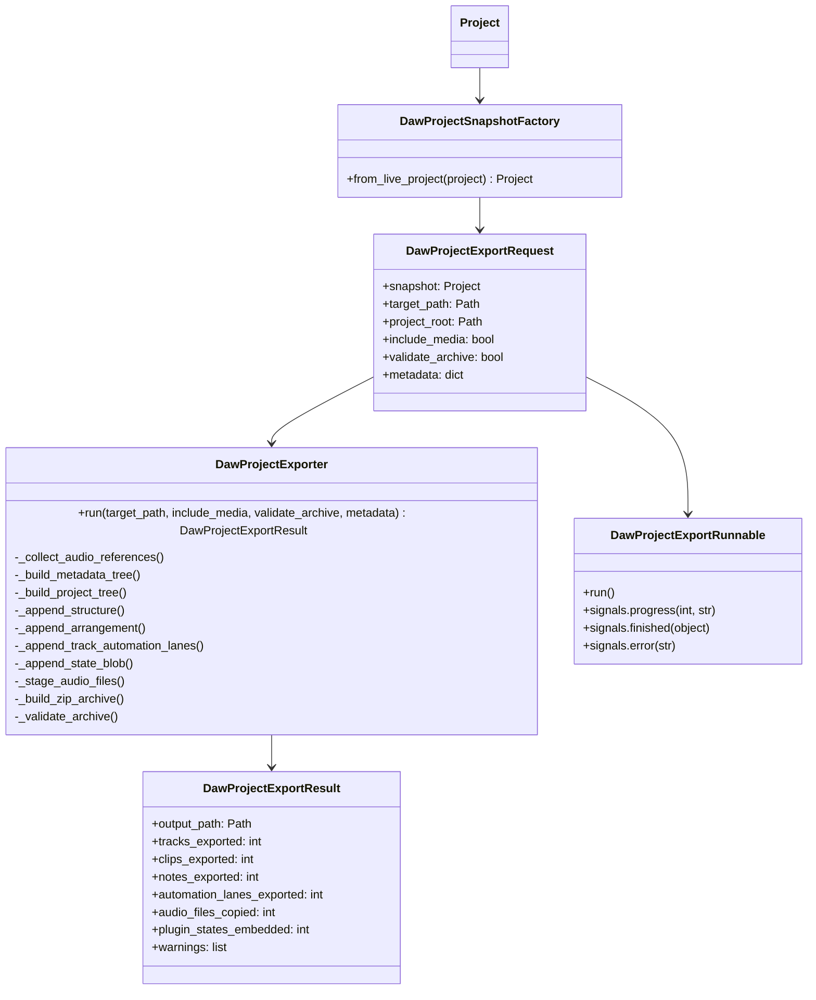

# DAWproject Export Architektur (safe scaffold)

**Version:** v0.0.20.358  
**Datum:** 2026-03-08  
**Status:** sichere Export-Grundlage ohne Eingriff in Audio-/Playback-Core

## Ziel

Ein **entkoppelter DAWprojectExporter** soll den aktuellen Projektzustand **als Snapshot** exportieren, ohne den laufenden Projektzustand, Undo/Redo, Audio-Thread oder UI-Modelle zu verändern.

## Sicherheitsprinzipien

- **Snapshot first:** Export arbeitet nur auf einer tief kopierten `Project`-Instanz.
- **Data Mapper only:** keine Änderungen am Live-`ProjectService`, keine DSP-Aufrufe.
- **Temp-File-First:** zuerst Staging-Ordner + temporäre ZIP, dann Validierung, dann `os.replace()`.
- **UI bleibt frei:** Worker-Runnable kann über `QThreadPool` gestartet werden.
- **Best effort:** fehlende Audio-Dateien erzeugen Warnungen statt Session-Schäden.

## Datenfluss

## High-Level Klassendiagramm

## Mapping-Strategie

### 1. Transport
- `Project.bpm` → `<Transport><Tempo value=... />`
- `Project.time_signature` → `<TimeSignature numerator=... denominator=... />`

### 2. Struktur / Tracks
- `Track.id`, `Track.name`, `Track.kind` → `<Structure><Track ...>`
- `volume`, `pan`, `muted`, `solo` → `<Channel>`-Parameter
- `track_group_id`, `track_group_name` werden als sichere Zusatzattribute mitgegeben

### 3. Clips / Noten
- MIDI-Clips → `<Clip><Notes><Note ... /></Notes></Clip>`
- Audio-Clips → `<Clip><Audio><File path="audio/..." /></Audio></Clip>`
- Clip-spezifische Parameter (Gain/Pan/Pitch/Stretch/Clip-Automation) liegen konservativ in `<Extensions source="ChronoScaleStudio">`

### 4. Automation
- `Project.automation_manager_lanes` wird pro Spur nach `track_id` gefiltert
- Breakpoints werden als `<AutomationLanes><AutomationLane><Points><Point .../>...` geschrieben
- `curve_type`, `bezier_cx`, `bezier_cy` bleiben als Export-Metadaten sichtbar

### 5. Plugin-States
- Instrument-State und Device-States werden **nicht im Live-Engine-Kontext** gelesen
- Stattdessen werden gespeicherte Modell-/Chain-Daten als **Base64-Blobs in XML** eingebettet
- Erstes Ziel: **Datenfluss und Container-Architektur stabilisieren**, spätere Verfeinerung kann VST3/CLAP-spezifische Felder ergänzen

### 6. Audio-Referenzen
- Referenzierte Audio-Dateien werden aus `Project.media` und `Clip.source_path` gesammelt
- Im Archiv landen sie unter `audio/` mit kollisionssicherem Dateinamen
- Fehlende Dateien erzeugen Warnungen, blockieren aber nicht die ganze Session

## Geplante nächste sichere Schritte

1. Optionaler **MainWindow/UI-Hook**: Menüpunkt `Datei → DAWproject exportieren…` sauber anbinden
2. Optionaler **ProgressDialog + QThreadPool**-Pfad auf Basis des neuen `DawProjectExportRunnable`
3. Verfeinertes **VST3/CLAP-State-Mapping**, falls echte Preset-Blobs/Chunks im Modell vorhanden sind
4. Optionaler **Roundtrip-Test**: Export → Import in leeres Projekt für Smoke-Validierung
5. Optionaler **XSD-/Schema-Check**, falls später ein offizieller Validator eingebunden wird
